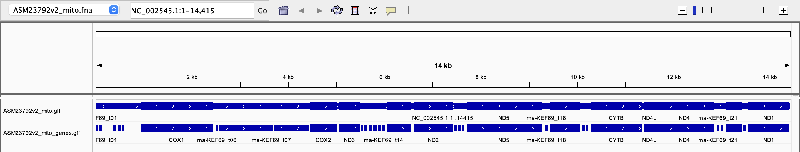
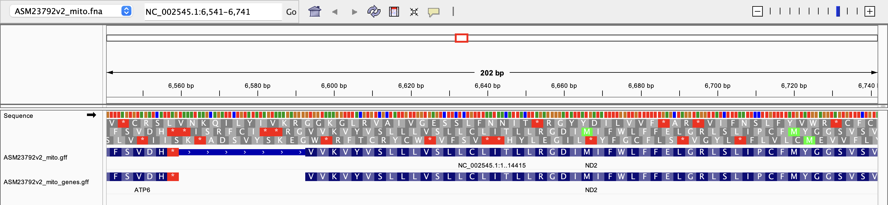
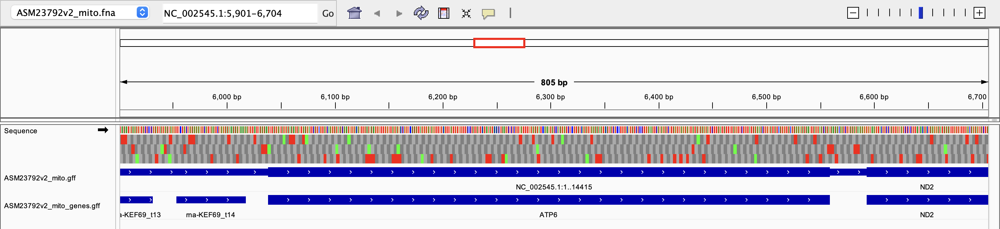

# Week 3 Assignment: Visualizing genomic data
## Will Vuyk • BMMB852 • 2025-09-13

This assignment involves loading a fasta and gff file of a chosen organism into IGV, visualizing and describing the genome, and then editing the GFF file into multiple simplified annotation tracks. 

### Note: This README includes my whole process of completing this assignment. If you want to skip to what ended up working, skip down to "Second Try: Using NCBI"


Activate bioinfo environment:

```
micromamba activate bioinfo
```

### Use IGV to visualize your genome and the annotations relative to the genome.
#### 1) Organize your working directory
To replicate this analysis, first define the path to your working directory. Mine is called "03_IGVDataViz". Fill in YOURPATH below:

```
DIR=YOURPATH/03_IGVDataViz
```

Make your working directory at that path ***if it does not already exist*** using `mkdir`

```
mkdir -p $DIR
```

Next, move into that new working directory using cd

```
cd $DIR
```


#### 2) Download and unzip fasta and GFF3 files from Ensemble

Once in your working directory, find the files you want to download from [Ensemble Public FTP site](https://ftp.ensemblgenomes.ebi.ac.uk/pub/) and the link to those files. 

I am currently interested in the mitochondria genomes of trematodes, so I am going to find a well-annotated tremetode genome and extract the mitochondrial sequence. Shistosoma mansoni, a human blood fluke, fits the bill. 

Remove the .gz from your filename so it ends in `gff3` or `fa`. Your link, on the other hand, should be complete.

```
GFF=Schistosoma_mansoni.Smansoni_v7.62.chr.gff3
GFF_LINK=https://ftp.ensemblgenomes.ebi.ac.uk/pub/metazoa/current/gff3/schistosoma_mansoni/Schistosoma_mansoni.Smansoni_v7.62.chr.gff3.gz

FASTA=Schistosoma_mansoni.Smansoni_v7.dna.toplevel.fa
FASTA_LINK=https://ftp.ensemblgenomes.ebi.ac.uk/pub/metazoa/current/fasta/schistosoma_mansoni/dna/Schistosoma_mansoni.Smansoni_v7.dna.toplevel.fa.gz
```

Use the unix command `wget` to download the files

```
wget $FASTA_LINK
wget $GFF_LINK
```


Assess downloaded file size and compression using `ls`

```
ls -lh
```

Unzip compressed GFF file using `gunzip`. This is why we removed the .gz from the filename above when defining the variables above.

```
gunzip $FASTA.gz
gunzip $GFF.gz
```

Check that the files are unzipped using `ls`

```
ls -lh   
```

#### 3) Get preliminary look at files using unix commands

Print first 10 lines of GFF file to the screen using `head` for a first look

```
cat $FASTA | head
cat $GFF | head
```

Can also look at the last 10 lines using `tail`

```
cat $FASTA | tail
cat $GFF | tail
```

To view more of the file on your screen, use the following:

```
cat $FASTA | more
cat $GFF | more
```

Extract GFF lines containing the string "sequence-region" using `grep` and add them to new text file called sequence_regions.txt

```
cat $GFF | grep "sequence-region" > GFF_sequence_regions.txt
```

### Shoot, looking at the GFF_sequence_regions.txt file, it looks like mitochondrial annotations are not included. I will need to find a different reference that includes MT.

#### Use preliminary look to extract mitochondrial sequence and annotations - this is what I would have tried if the ensembl files had MT.

Extract mitochondrial sequence
```
samtools faidx $FASTA MT > mitochondrial.fa
```

Extract mitochondrial annotations from GFF3
```
grep "^MT" chr.gff3 > mitochondrial_annotations.gff3
```

### Second Try: using NCBI 

#### 2) Download and unzip fasta and GFF3 files from NCBI

Once in your working directory, find the files you want to download from [NCBI](https://ftp.ncbi.nlm.nih.gov/genomes/all/GCF/000/237/925/GCF_000237925.1_ASM23792v2/) and the link to those files. 

I am currently interested in the mitochondria genomes of trematodes, so I am going to find a well-annotated tremetode genome and extract the mitochondrial sequence. Shistosoma mansoni, a human blood fluke, fits the bill. 

Remove the .gz from your filename so it ends in `gff3` or `fa` or `fna`. Your link, on the other hand, should be complete.

```
GFF=GCF_000237925.1_ASM23792v2_genomic.gff
GFF_LINK=https://ftp.ncbi.nlm.nih.gov/genomes/all/GCF/000/237/925/GCF_000237925.1_ASM23792v2/GCF_000237925.1_ASM23792v2_genomic.gff.gz

FASTA=GCF_000237925.1_ASM23792v2_genomic.fna
FASTA_LINK=https://ftp.ncbi.nlm.nih.gov/genomes/all/GCF/000/237/925/GCF_000237925.1_ASM23792v2/GCF_000237925.1_ASM23792v2_genomic.fna.gz
```

Use the unix command `wget` to download the files

```
wget $FASTA_LINK
wget $GFF_LINK
```


Assess downloaded file size and compression using `ls`

```
ls -lh
```

Unzip compressed GFF file using `gunzip`. This is why we removed the .gz from the filename above when defining the variables above.

```
gunzip $FASTA.gz
gunzip $GFF.gz
```

Check that the files are unzipped using `ls`

```
ls -lh   
```

#### 3) Get preliminary look at files using unix commands

Print first 10 lines of GFF file to the screen using `head` for a first look

```
cat $FASTA | head
cat $GFF | head
```

Can also look at the last 10 lines using `tail`

```
cat $FASTA | tail
cat $GFF | tail
```

To view more of the file on your screen, use the following:

```
cat $FASTA | more
cat $GFF | more
```

#### find how mitochondrial annotations are labeled in GFF and extract mito annotations into new file

Extract GFF lines containing the string "sequence-region" using `grep` and add them to new text file called sequence_regions.txt

```
cat $GFF | grep "sequence-region" > NCBI_GFF_sequence_regions.txt
```
According to NCBI, the MT sequence is labeled "NC_002545.1". Using command F in the `NCBI_GFF_sequence_regions.txt` file I see that this sequence is included, and is the proper size:

```
##sequence-region NC_002545.1 1 14415
```

Count number of mitochondrial annotations

```
cat $GFF | grep -v "^#" | grep "NC_002545.1" | wc -l
```

Write lines containing mitochondria label to a new mito only gff
```
cat $GFF | grep "NC_002545.1" > ASM23792v2_mito.gff
```

Define new easier to type variable

```
mitoGFF=ASM23792v2_mito.gff
```

```
cat $mitoGFF | head
```

Check if has the same number of lines (here 124)

```
cat $mitoGFF | grep -v "^#" | wc -l
```


##### find how mitochondrial sequences are labeled in FASTA and extract mito sequence into new file

```
cat $FASTA | grep ">" > NCBI_FASTA_sequence_regions.txt
```
Looking at the `NCBI_FASTA_sequence_regions.txt` file, I see that the complete mitochondrial genome is labelled with the same identifier:

```
>NC_002545.1 Schistosoma mansoni mitochondrion, complete genome
```

Extract only mitochondrial sequence from whole fasta file
```
samtools faidx $FASTA  # create index
samtools faidx $FASTA NC_002545.1 > ASM23792v2_mito.fna # extract mito genome
```

Define new easier to type variable
```
mitoFASTA=ASM23792v2_mito.fna
```

Check if extracted mito genome looks right

```
cat $mitoFASTA | head
cat $mitoFASTA | tail
```

Count number of characters (bp) in file except for first line (index name)

```
cat $mitoFASTA | grep -v "^>" | tr -d '\n' | wc -c
```

The result for this sequence is 14415, which is correct according to NCBI. 

### Load into IGV

Now that we have a mitochondrial fasta and gff file, time to load into IGV for visualization. 

Starting with "load genome from file" option in IGV_2.19.6

The genome I am working with appears as ~14kb, which is good. 

Then I also load the gff from file, and it loads in as a track - good sign!

#### How big is the genome, and how many features of each type does the GFF file contain?
The genome is 14415 bp long

According to 

```
cat $mitoGFF | cut -f 3 | grep -v "^#" | sort-uniq-count-rank > mito_features_ranked.txt
```
It contains:

```
37	exon
37	gene
23	tRNA
12	CDS
12	mRNA
2	rRNA
1	region
```

#### From your GFF file, separate the intervals of type "gene" or "transcript" into a different file. Show the commands you used to do this.

```
cat $mitoGFF | grep "gene" > ASM23792v2_mito_genes.gff
```



The simplified (gene) gff is easier to interpret.

#### Zoom in to see the sequences, expand the view to show the translation table in IGV. Note how the translation table needs to be displayed in the correct orientation for it to make sense.



Genes can be on either the forward or reverse strand, so they could potentially be read in 6 different reading frames (3 forward, 3 reverse) so the correct orientation of the translation table is important.

#### Visually verify that the first coding sequence of a gene starts with a start codon and that the last coding sequence of a gene ends with a stop codon.



