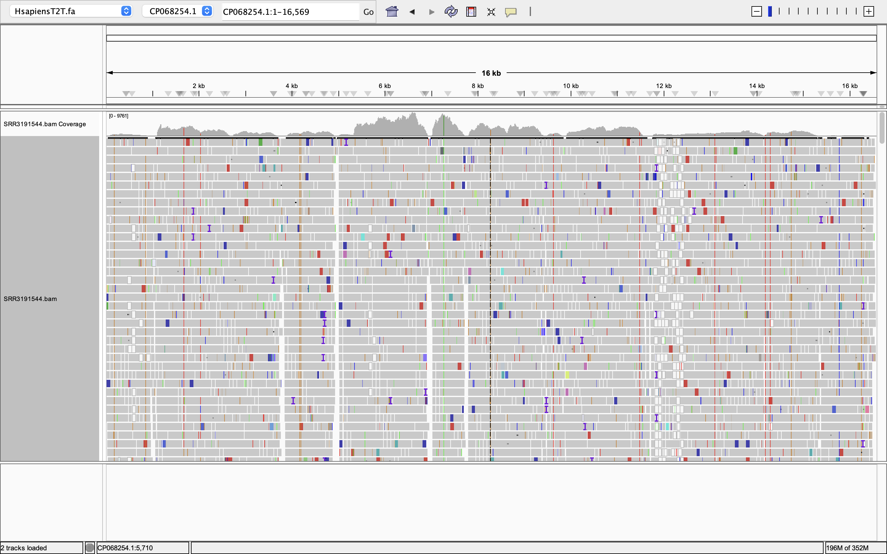
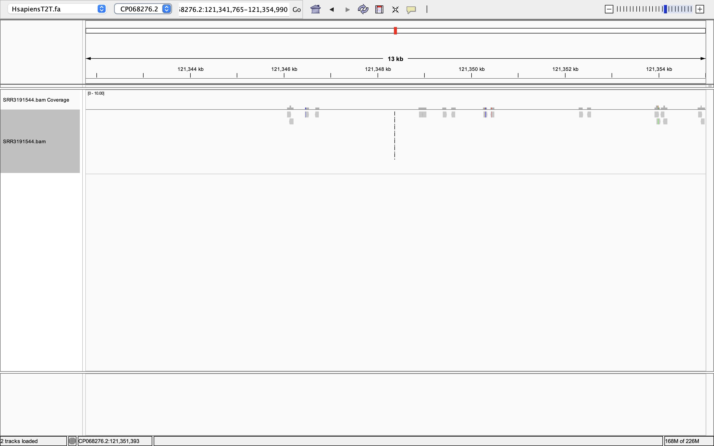

# Week 6 Assignment: Generate a BAM alignment file
## Will Vuyk • BMMB852 • 2025-10-05

### Creating Makefile
For this part of the homework, I used the Makefile provided in on the FastTrack Bioinformatics [website](https://www.biostarhandbook.com/fast/methods/makefiles/), and made minor adjustments for my own purposes. This file can be found in this directory as `Makefile`.

This Makefile first has a section for defining variables (ACC, NAME, SRR, N, R1, R2, and BAM), then sets specific Makefile default settings (annotated in file), before defining targets. The targets are as follows: 

- usage (describes usage of file) 
- refs (obtains ACC reference genome fasta from NCBI genomes)
- fastq (obtains N fastq reads of SRR from SRA)
- index (indexes reference genome with BWA)
- align (aligns R1 and R1 files to the indexed reference using bwa mem and samtools to create BAM)
- stats (runs samtools flagstat on BAM)
- clean (removes intermediary files)
- all (runs all targets)

### Running Makefile
My group has been assigned the Tang et al., (2016) paper "ZIka Virus Infects Human Cortical Neural Progenitors and Attenuates Their Growth". The data provided by this paper is RNAseq sequences of human cortical neural progenitor cells. Therefore I will use the best human reference (T2T) as the reference fasta and the RNAseq files from the paper's bioproject on SRA. The accessions are as follows:

- T2T Human Genome: GCF_009914755.1
- Tang et al., (2016) zika-infected hNPC RNAseq: SRR3191544

Therefore, in the Makefile, ACC=GCF_009914755.1 and SRR=SRR3191544. Name=HsapiensT2T. I have set N=10,000,000 because this should give ~10x coverage of the human transcriptome (assuming the human transcriptome is ~80Mb long). I know ahead of time that each SRA files contain less than this, so this should grab all of both. 

First time I tried to run the Makefile I got a "*** missing separator" error. This was because some of the tab lines had become spaces instead. I fixed this and then it ran smoothly.

I also had to change SHELL=bash to SHELL=/bin/bash

To run:

```
make all
```

### Visualize the resulting BAM files for both simulated reads and reads downloaded from SRA.

To simulate reads, I have made a new makefile called `sim_makefile`.

I am using ART, which is installed this way:

```
micromamba install art
```

To run this new makefile, do this. I am only running simulate align and stats because the other ones have already been done. The -f flag allows me to specify a different makefile from the one I already have named "Makefile". 

```
make -f sim_makefile simulate align stats
```
I had to end this because it was taking far too long. I should still have enough simulated reads to use. This ended up running for 2 hours and not finishing, so I will not have these results in time. It seems to have been working though! Human genome is just too big. 

### Generate alignment statistics for the BAM file.

Results of SRA mapping
```
samtools flagstat bam/SRR3191544.bam
15312115 + 0 in total (QC-passed reads + QC-failed reads)
14723054 + 0 primary
0 + 0 secondary
589061 + 0 supplementary
0 + 0 duplicates
0 + 0 primary duplicates
14984666 + 0 mapped (97.86% : N/A)
14395605 + 0 primary mapped (97.78% : N/A)
14723054 + 0 paired in sequencing
7361527 + 0 read1
7361527 + 0 read2
11936376 + 0 properly paired (81.07% : N/A)
14341750 + 0 with itself and mate mapped
53855 + 0 singletons (0.37% : N/A)
191774 + 0 with mate mapped to a different chr
153447 + 0 with mate mapped to a different chr (mapQ>=5)
```

*What percentage of reads aligned to the genome?*
97.78% mapped 

*What was the expected average coverage?*
10x

*What is the observed average coverage?*
This is wierd because it is RNAseq, so only the transcriptome. But what is the transcriptome? I don't know how to calculate this from mapping to the whole genome.

*How much does the coverage vary across the genome? (Provide a visual estimate.)*
Coverage is very sparse. Only the mitochondria is densely covered.



This image shows deep coverage on human mitochondria.


This image shows sparse chromosomal coverage - tough to even find mapped reads on some chromosomes.


