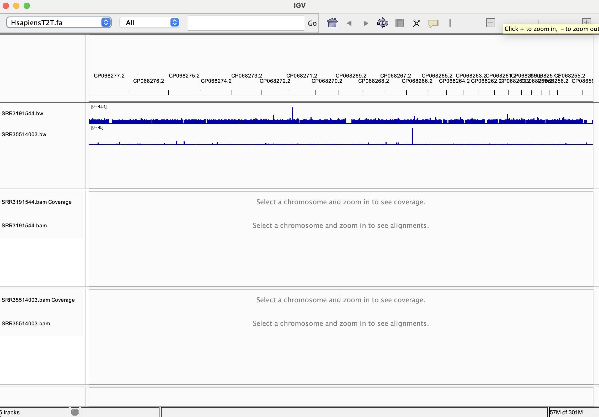
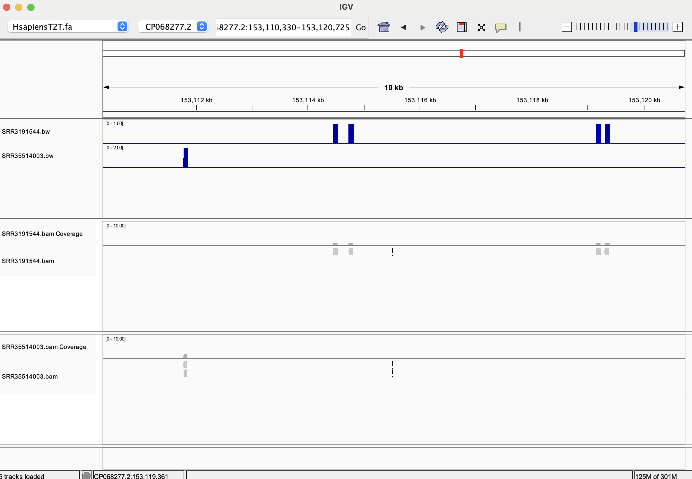

# Week 7 Assignment: Write a reusable alignment Makefile
## Will Vuyk • BMMB852 • 2025-10-12

### Writing a reusable alignment Makefile
Starting with the Makefile from Week 6, I made some slight improvements. All statistics steps now create txt files in a new directory called "stats". There are now two new targets: `annotations` and `wiggle`. `annotations` uses NCBI datasets to download genome annotation files (like gff3,gtf) specified using the variable `${ANNOT}`. `wiggle` creates a BigWig file from the bam created in the `align` step. 

Additionally, the Makefile can now accommodate both single and paired-end reads due to if/else statements added in the `fastq` and `align` targets.

Now the Makefile usage is as follows:

```
# Makefile for aligning reads from SRA to a genome from NCBI genomes with BWA, and making wiggle file for visualization

# Input variables: Genome accession=${ACC}, Interpretable reference name=${NAME}, annotation file types=${ANNOT} (options are:cds, gbff, genome, gff3, gtf, none, protein, rna, seq-report), SRA accession=${SRR}, number of reads=${N}

# Usage: make [all|refs|annotations|fastq|index|align|stats|wiggle|clean]
```

### Demonstration of use

For this demonstration I will be first aligning SRR3191544 zika-infected human paired-end hNPC RNA-seq reads from Tang et al., (2016) to the human T2T reference genome GCF_009914755.1. 

For a second demonstration, I will be aligning SRR35514003 colon cancer single-end RNA-seq reads done on an Element Aviti sequencer to the human T2T reference genome GCF_009914755.1.

#### Demonstration 1

Note: I am only pulling 10,000 reads because 10 milllion took multiple hours last time.

```
micromamba activate bioinfo
make all ACC=GCF_009914755.1 NAME=HsapiensT2T ANNOT=gff3 SRR=SRR3191544 N=10000
```

#### Demonstration 2

For demonstration 2 we do not need to make all, we just need to download the fastq, align, stats and wiggle. 

```
make fastq align stats wiggle ACC=GCF_009914755.1 NAME=HsapiensT2T SRR=SRR35514003 N=10000
```

### Visualize the GFF annotations and both wiggle and BAM files in IGV all next to one other so that you can visually compare the two alignment datasets.

### Answer the following questions:

*Briefly describe the differences between the alignment in both files.*
The `SRR3191544` has higher and more even coverage than `SRR35514003`. `SRR35514003` has a very tall read pileup near CP068266.2.





*Briefly compare the statistics for the two BAM files.*
The paired-end file `SRR3191544` has twice the number of reads than the single-end file `SRR35514003`. This sounds obvious, but I wasn't sure until now how fastq-dump accounted for this when specifying read count. Good to know. Otherwise the two BAMs seem similar. 96.61% of `SRR3191544` successfully mapped, while 96.29% of `SRR35514003` successfully mapped. Both had zero QC failed reads.

*How many primary alignments does each of your BAM files contain?*
20,000 for `SRR3191544` and 10,000 for `SRR35514003`, as mentioned above. N for this run was 10,000.

*What coordinate has the largest observed coverage (hint samtools depth)*
To find this, I used the samtools depth code from the course website:

```
# Find regions with highest coverage
samtools depth bam/SRR35514003.bam | sort -k3 -nr | head
```
In SRR3191544.bam all of these locations are tied with 18x depth

```
CP068254.1      7194    18
CP068254.1      7193    18
CP068254.1      7192    18
CP068254.1      7190    18
CP068254.1      7189    18
CP068254.1      7188    18
CP068254.1      7187    18
CP068254.1      7186    18
CP068254.1      7185    18
```

In SRR35514003.bam, these locations are tied with 126x depth
```
CP068254.1      16250   126
CP068254.1      16249   126
```


*Select a gene of interest. How many alignments on a forward strand cover the gene?*
I couldn't load the GFF file into IGV because it wasn't indexed. I didn't know gffs also had to be indexed. Maybe this is becasue the human T2T gff file is so big and detailed. I tried to index the gff file with the following code below that ChatGPT recommended, but this didn't work either and seems uneccessarily complicated.

```
(grep '^#' HsapiensT2T_annotations/data/GCF_009914755.1/genomic.gff; grep -v '^#' HsapiensT2T_annotations/data/GCF_009914755.1/genomic.gff | grep -v '^$' | sort -k1,1 -k4,4n) | bgzip > HsapiensT2T_annotations/data/GCF_009914755.1/genomic.sorted.gff.gz && tabix -p gff HsapiensT2T_annotations/data/GCF_009914755.1/genomic.sorted.gff.gz
```

This code did create a genomic.sorted.gff.gz file. When I tried to load that into IGV the program froze and my computer fans became very loud. I had to force quit IGV.