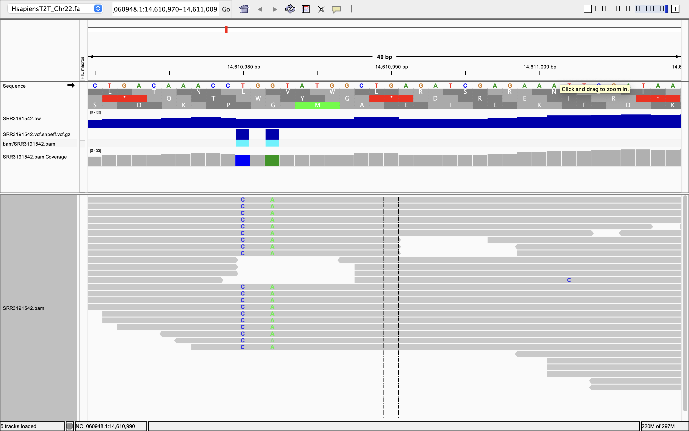
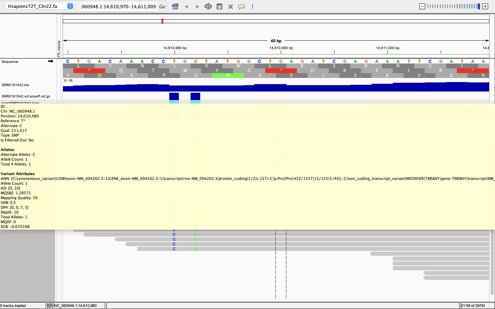
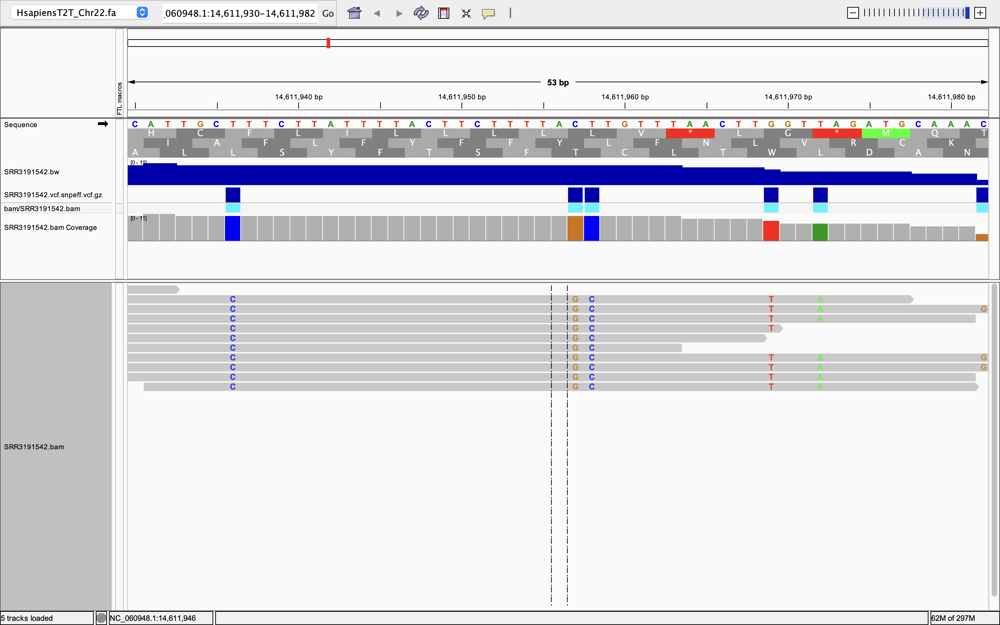
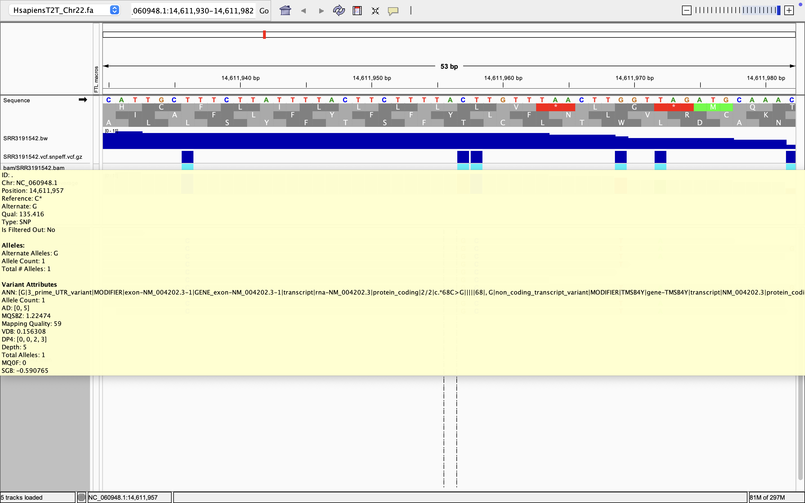

# Week 11 Assignment: Establish the effects of variants
## Will Vuyk • BMMB852 • 2025-11-09

## Overview
This week I have run snpEFF to provide variant effect annotations.

I am using Bioproject `PRJNA313294` from the paper [Tang et al., 2016](https://pmc.ncbi.nlm.nih.gov/articles/PMC5299540/) which collected RNAseq data from human cortical neural precursor cells infected with Zika virus.

For speed and ease of use, this workflow only aligns the Tang fastq sequences to human chromosome 22, which is the second smallest human chromosome. To do this, the workflow downloads the Human T2T fasta file and the entire Human T2T gff file from NCBI. Chr 22 annotations are then extracted from the entire T2T gff file using grep. The Chr 22 fasta and gff are then used to build a custom snpEff database, as there are no pre-made snpEFF databases that are well suited to this purpose. 

snpEff code in this Makefile has been edited from the snpeff.mk file in the bio code toolbox. 

## Workflow summary

1) Makes design file from bioproject accession

2) `ref` downloads and annotates the reference fasta and gff.

3) `readsvcf` downloads fastq files from the design.csv file, aligns them to the reference using BWA, and generates vcf files using bcftools. 

4) `snpeff_build` builds a custom snpEff database.

5) `snpeff_run` runs snpEff using the custom database.

## Workflow usage

Makefile for aligning reads from SRA to a genome from NCBI with BWA, and making wiggle file for visualization

Input variables:

Genome accession=${ACC}"

Accession for annotation file=${ANNOT_ACC}"

Interpretable reference name=${NAME}

Annotation file types=${ANNOT}
(options are: cds, gbff, genome, gff3, gtf, none, protein, rna, seq-report)

SRA accession=${SRR}

Number of reads=${N}

VCF file=${VCF}

Usage: make [all|ref|reads|fasta|annotations|index|fastq|fastqc|align|stats|wiggle|vcf|readsvcf|snpeff_build|snpeff_run|clean]

make ref will download and index the reference genome and annotations.

make reads will download, quality check, align the reads, generate stats, and make wiggle files.

make readsvcf will download, quality check, align the reads, generate stats, and make wiggle and vcf files.

make snpeff_build will build the snpEff database.

make snpeff_run will run snpEff to annotate the VCF file.

## Troubleshooting notes

I had two targets called "index" and both were running. Bad problem. Note to self to make sure I have no duplicate targets in Makefiles moving forward.

Bio fetch fails most times. I have to run multiple times for one to work. May be because I have not updated the program yet.

To make snpEFF work, I now extract only Chr22 annotations from the whole Human T2T GFF file. This is something I should have done from the beginning, and now everything not only works but runs faster.

## Run workflow in parallel

### Make design file with `esearch|efetch` (*only need to run once*)
```
esearch -db sra -query PRJNA313294 | efetch -format runinfo > design.csv
```
### Obtain reference and annotations (*only need to run once*)
```
make ref ACC=NC_060948.1 NAME=HsapiensT2T_Chr22 ANNOT_ACC=GCF_009914755.1 ANNOT=gff3
```
### Run readsvcf on every sequence in design.csv (*parallelized*)
```
cat design.csv | \
    parallel --colsep , --header : --eta --lb -j 2 \
             make \
             readsvcf \
             SRR={Run} \
             NAME=HsapiensT2T_Chr22 \
             N=100000
```
### Build custom snpEFF database for specific chromosome of human genome (*only need to run once*)
```
make snpeff_build NAME=HsapiensT2T_Chr22 ANNOT_ACC=GCF_009914755.1 SRR=SRR3191544
```
### Run snpeff on every sequence in design.csv (*parallelized*)
```
cat design.csv | \
    parallel --colsep , --header : --eta --lb -j 2 \
             make \
             snpeff_run \
             SRR={Run} \
             NAME=HsapiensT2T_Chr22 \
             ANNOT_ACC=GCF_009914755.1
```

## Run workflow on specific file (not in parallel)

### Obtain reference and annotations 
```
make ref ACC=NC_060948.1 NAME=HsapiensT2T_Chr22 ANNOT_ACC=GCF_009914755.1 ANNOT=gff3
```
### Run readsvcf on designated SRR sequence
```
make readsvcf NAME=HsapiensT2T_Chr22 SRR=SRR3191544 N=100000 
```
### Build custom snpEFF database for specific chromosome of human genome
```
make snpeff_build NAME=HsapiensT2T_Chr22 ANNOT_ACC=GCF_009914755.1 SRR=SRR3191544
```
### Run snpEFF on designated SRR sequence
```
make snpeff_run NAME=HsapiensT2T_Chr22 ANNOT_ACC=GCF_009914755.1 SRR=SRR3191544
```


## snpEFF variant effect evaluation

To evaluate the variant effect calls from snpEFF, I loaded the reference fasta, one of the aligned bam files (SRR3191542), and its associated SRR3191542.vcf.snpeff.vcf.gz file into IGV.

Three variants I located with OK coverage (5-10x) were as follows in the format (Reference nucleotide)(Reference nucleotide position)(Variant nucleotide)

### First two variants 



#### T14610980C


This variant is in the third position of the annotated Proline codon and does not change that amino acid. It is therefore a synonymous mutation.

#### G14610982A


This variant is in the second position of the annotated Glycine codon and changes that amino acid to Aspartic acid. It is therefore a non-synonymous mutation.

### 3rd Variant (Brown G second from left)


#### C14611957G


This variant is non-synonymous and labeled as a 3-prime UTR variant. These variants in UTRs (untranlasted regions) can influence gene expression. This could be of potential interest to the researchers of the Tang et al study because they are interested in the gene expression of this particular cell line when infected with ZIKV.

