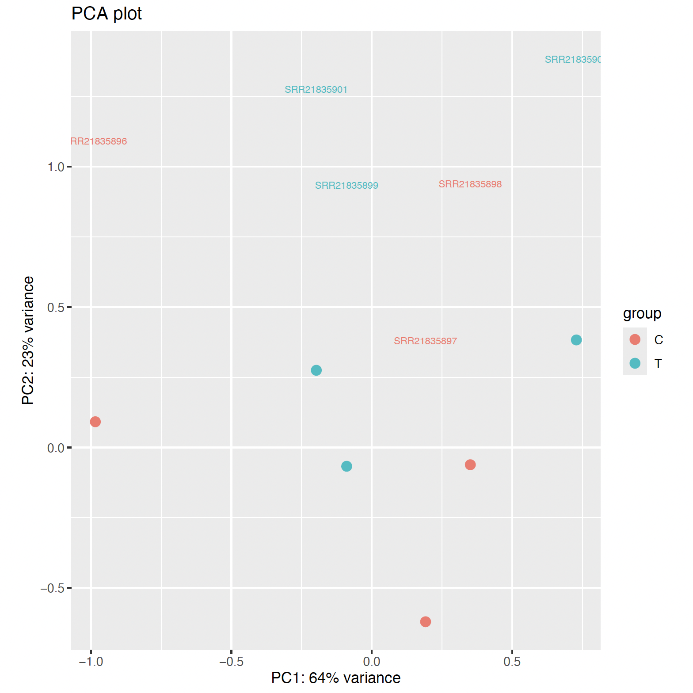

# Week 13 Assignment: RNAseq
## Will Vuyk • BMMB852 • 2025-12-07

## Overview
This week the assignment is to run an RNAseq analysis including the following steps:

1) Download the genome and sequence data from the SRA
2) Align/Classify reads relative to the genome
3) Quantify the expression levels
4) Compare the expression levels to find up- and down-regulated genes
5) Visualize and interpret the results

Of the options provided on the course website, I decided to try to replicate some of the analyses in the paper "RNA-Seq-based transcriptome analysis of methicillin-resistant Staphylococcus aureus growth inhibition by propionate". Link to paper [here](https://www.frontiersin.org/journals/microbiology/articles/10.3389/fmicb.2022.1063650/full).

This paper reports that 171 genes were differentially expressed in propionate treated bacteria, with 131 of those being up-regulated. I will see if I can replicate this result using their sequences. 


# 1) Download the genome and sequence data from the SRA

**Bioproject**
PRJNA887926

To get the metadata from this bioproject I did the following:
```
bio search PRJNA887926 -H --csv > design.csv
```

**Sequences**
| SRR ID     | Group     | Name                     |
|-----------|-----------|--------------------------|
| SRR21835898 | Control   | Control Rep 1           |
| SRR21835897 | Control   | Control Rep 2           |
| SRR21835896 | Control   | Control Rep 3           |
| SRR21835901 | Treatment | Sodium Propionate Rep 1 |
| SRR21835900 | Treatment | Sodium Propionate Rep 2 |
| SRR21835899 | Treatment | Sodium Propionate Rep 3 |

The above sequences are multiple Gb each, and take a logn time to download. Therefore, I have downsampled them 100x (300 thousand reads). To download the downsampled fastq sequences in parallel, do the following:
```
cat design.csv | parallel --colsep , --header : --eta --lb -j 3 make SRR={run_accession} N=300000 NAME=Saureus_USA300_FPR3757 fastq
```

**Reference and Annotations** 
S. aureus subsp. aureus USA300_FPR3757 (NCBI Reference Sequence: NC_007793.1)

To get this reference sequence and its annotations, I did this:
```
make ref ACC=GCF_000013465.1 NAME=Saureus_USA300_FPR3757 ANNOT=gff3,gtf
```
**Annotation/Reference Mismatch Problem:**
The reference and annotation files use different naming conventions (NC vs CP). I had to manually alter the reference fasta to replace CP ids with NC ids so the GFF and GTF files would load properly in IGV.


# 2) Align/Classify reads relative to the genome

To do this, I followed the Hisat2 directions on the course page, which uses the hisat2.mk in the bioinformatics toolbox.

```
# Get the bioinformatics toolbox
bio code

# Index the genome
make -f src/run/hisat2.mk index REF=refs/Saureus_USA300_FPR3757.fa
```

Use Hisat2 to align all samples in parallel

```
cat design.csv | parallel --colsep , --header : --eta --lb -j 3 make -f src/run/hisat2.mk REF=refs/Saureus_USA300_FPR3757.fa R1=reads/{run_accession}_1.fastq BAM=bam/{run_accession}.bam run
```

Include IGV screenshots that demonstrate your data is RNA-Seq data:

# 3) Quantify the expression levels

featureCounts (see below) is only identifying 5 genes with sufficient read counts for further analysis. These 5 genes also do not appear to vary significantly between control and treatment groups. I wonder if this is an annotation quality issue? It could also be due to how much I downsampled and how many reads actually mapped to the reference.

## Counts

Use the code below to run featureCounts to make a counts.txt file from the input BAMs:
```
featureCounts -a Saureus_USA300_FPR3757_annotations/data/GCF_000013465.1/genomic.gtf -o counts.txt bam/SRR21835896.bam bam/SRR21835897.bam bam/SRR21835898.bam bam/SRR21835899.bam bam/SRR21835900.bam bam/SRR21835901.bam
```

Reformat counts.txt into a .csv using R in stats environment:
```
micromamba activate stats

Rscript src/r/format_featurecounts.r -c counts.txt -o counts.csv
```

## Transcript Gene mapping

I can see how this step would be useful, but I cannot find staph aureus in this list:
```
Rscript src/r/create_tx2gene.r -s > names.txt
```

# 4) Compare the expression levels to find up- and down-regulated genes

Using edger to quantify RNAseq differential expression:

```
Rscript src/r/edger.r
```
To run edger, I had to modify the design.csv to change "run_accession" to "sample" and add a "group" column with C for control and T for treatment.

Results:
```
Rscript src/r/edger.r
# Initializing edgeR tibble dplyr tools ... done
# Tool: edgeR 
# Design: design.csv 
# Counts: counts.csv 
# Sample column: sample 
# Factor column: group 
# Factors: C T 
# Group C has 3 samples.
# Group T has 3 samples.
# Method: glm 
# Input: 72 rows
# Removed: 67 rows
# Fitted: 5 rows
# Significant PVal:    0 ( 0.00 %)
# Significant FDRs:    0 ( 0.00 %)
# Results: edger.csv 
(stats) 
```

This aligns with the counts.csv file. Only 5 genes, non-significant. 

# 5) Visualize and interpret the results

I ran a PCA with:

```
src/r/plot_pca.r -c edger.csv 
```

But this doesn't seem right. In IGV the controls and treatments are distinguishable. Here not so much. 



IGV visualizations:

These sequence reads to appear to be RNAseq, and align roughly with annotated transcripts:


All sample bigwigs aligned together. Top three tracks are controls, bottom three are treatment. Some differences visible from this level.


Closer up, visible differences between treatment and control is more clear.


# 6) Discussion
I was unable to replicate the results in the paper that found 171 differentially regulated genes. I did have some issues with the annotation files, and I severely downsampled the sequences (100x), so these two factors could have contributed to my much sparser and less significant results. 

I was able to visually discern the treatment from control groups in IGV, however, so I'm wondering if something else is going on with my use of featureCounts and Edger. Not sure! My best guess is that there's something suboptimal with how I've selected or handled these annotation files. 


