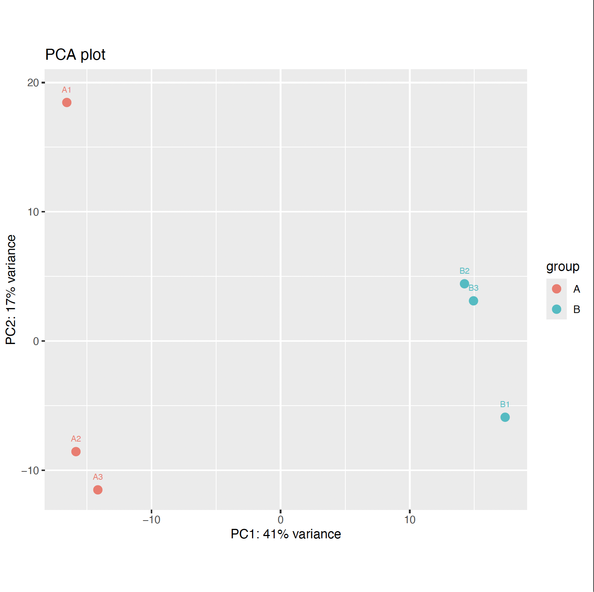
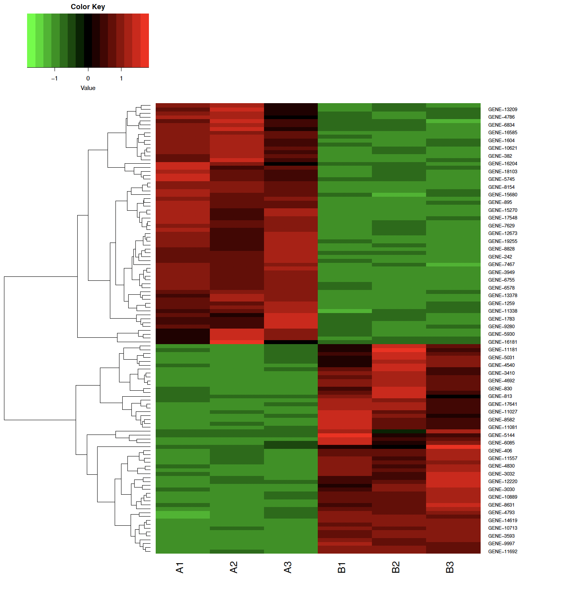
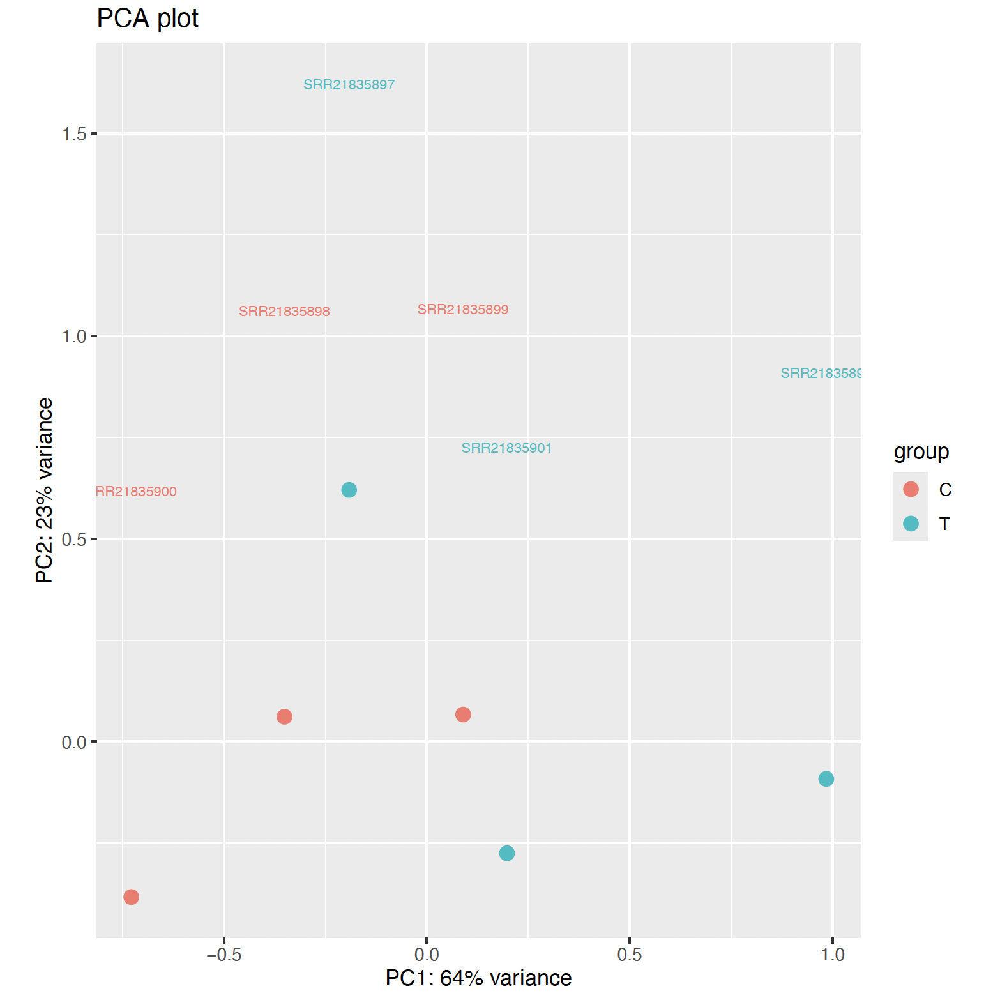
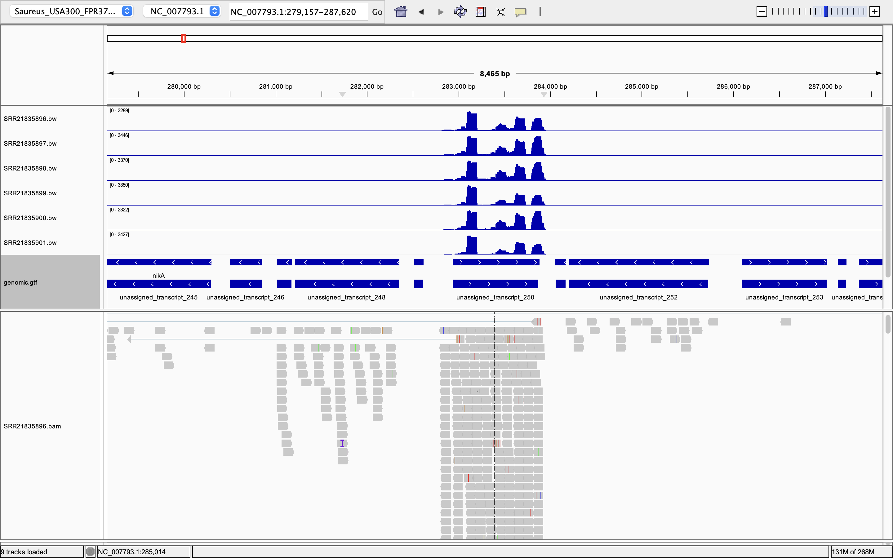
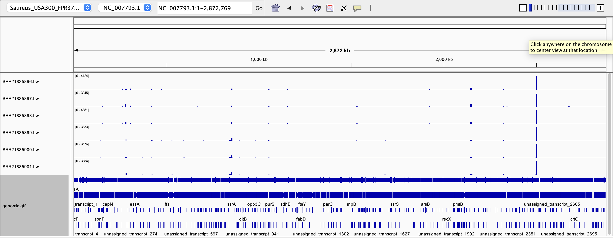
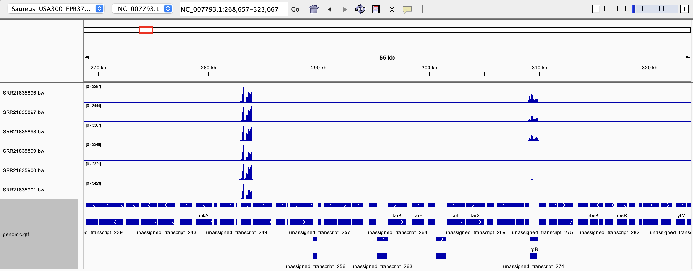

# Week 13 Assignment: RNAseq Differential Gene Expression Analysis
## Will Vuyk • BMMB852 • 2025-12-14

## Overview
This weeks assignment is to expand upon last week's RNAseq analysis with differential gene expression and functional enrichment. I will also test this workflow with simulated data, as last week's analysis did not lead to any significant findings despite what was published in the paper being replicated [here](https://www.frontiersin.org/journals/microbiology/articles/10.3389/fmicb.2022.1063650/full).

1) Download the genome and sequence data from the SRA
2) Align/Classify reads relative to the genome
3) Quantify the expression levels
4) Simulate known expression levels
4) Compare the expression levels to find up- and down-regulated genes in both real and simulated data
5) Visualize and interpret the results

Of the options provided on the course website, I decided to try to replicate some of the analyses in the paper "RNA-Seq-based transcriptome analysis of methicillin-resistant Staphylococcus aureus growth inhibition by propionate". Link to paper [here](https://www.frontiersin.org/journals/microbiology/articles/10.3389/fmicb.2022.1063650/full).

This paper reports that 171 genes were differentially expressed in propionate treated bacteria, with 131 of those being up-regulated. I will see if I can replicate this result using their sequences. 


# 1) Download the genome and sequence data from the SRA

## Bioproject
PRJNA887926

To get the metadata from this bioproject I did the following:
```
bio search PRJNA887926 -H --csv > design.csv
```

## Sequences 
| SRR ID     | Group     | Name                     |
|-----------|-----------|--------------------------|
| SRR21835898 | Control   | Control Rep 1           |
| SRR21835897 | Control   | Control Rep 2           |
| SRR21835896 | Control   | Control Rep 3           |
| SRR21835901 | Treatment | Sodium Propionate Rep 1 |
| SRR21835900 | Treatment | Sodium Propionate Rep 2 |
| SRR21835899 | Treatment | Sodium Propionate Rep 3 |

The above sequences are multiple Gb each, and take a logn time to download. Therefore, I have downsampled them 100x (300 thousand reads). To download the downsampled fastq sequences in parallel, do the following:
```
cat design.csv | parallel --colsep , --header : --eta --lb -j 3 make SRR={run_accession} N=300000 NAME=Saureus_USA300_FPR3757 fastq
```

## Reference and Annotations 
S. aureus subsp. aureus USA300_FPR3757 (NCBI Reference Sequence: NC_007793.1)

To get this reference sequence and its annotations, I did this:
```
make ref ACC=GCF_000013465.1 NAME=Saureus_USA300_FPR3757 ANNOT=gff3,gtf
```

# 2) Align/Classify reads relative to the genome

To do this, I followed the Hisat2 directions on the course page, which uses the hisat2.mk in the bioinformatics toolbox.

## Get the bioinformatics toolbox
```
bio code
```

## Index the genome
```
make -f src/run/hisat2.mk index REF=refs/Saureus_USA300_FPR3757.fa
```

Use Hisat2 to align all samples in parallel

```
cat design.csv | parallel --colsep , --header : --eta --lb -j 3 make -f src/run/hisat2.mk REF=refs/Saureus_USA300_FPR3757.fa R1=reads/{run_accession}_1.fastq BAM=bam/{run_accession}.bam run
```

# 3) Quantify the expression levels

## Counts (Real Data)

Use the code below to run featureCounts to make a counts.txt file from the input BAMs:
```
featureCounts -a Saureus_USA300_FPR3757_annotations/data/GCF_000013465.1/genomic.gtf -o counts.txt bam/SRR21835896.bam bam/SRR21835897.bam bam/SRR21835898.bam bam/SRR21835899.bam bam/SRR21835900.bam bam/SRR21835901.bam
```

Reformat counts.txt into a .csv using R in stats environment:
```
micromamba activate stats
```
```
Rscript src/r/format_featurecounts.r -c counts.txt -o counts.csv
```

## Counts (Simulated Data)

To simulate RNAseq count data to benchmark analysis, do the following. Make sure to have previously used `bio code`.
```
mkdir -p simulation
```
```
cd simulation
```
```
src/r/simulate_counts.r 
```

## Expression (Simulated Data)

Run edger on simulated data in `simulation` directory:
```
Rscript src/r/edger.r
```

Evaluate results:

```
Rscript  src/r/evaluate_results.r  -a counts.csv -b edger.csv
```

Results:
```
# Tool: evaluate_results.r 
# 214 in counts.csv 
# 116 in edger.csv 
# 109 found in both
# 105 found only in counts.csv 
# 7 found only in edger.csv 
# Summary: summary.csv 
```

Generate PCA:

```
src/r/plot_pca.r -c edger.csv 
```




Generate heat map:

```
src/r/plot_heatmap.r -c edger.csv -d design.csv -o heatmap.pdf
```



## Expression (Real Data)

Run edger on real data in the `14_RNAseq` directory:

To run edger, I had to modify the design.csv to change "run_accession" to "sample" and add a "group" column with C for control and T for treatment (see attached design.csv).

```
Rscript src/r/edger.r
```

Generate PCA:

```
src/r/plot_pca.r -c edger.csv 
```



Generate heat map:

```
src/r/plot_heatmap.r -c edger.csv -d design.csv -o heatmap.pdf
```

Heat map results:

```
 src/r/plot_heatmap.r -c edger.csv -d design.csv -o heatmap.pdf
# Initializing  gplots tibble dplyr tools ... done
# Tool: Create heatmap 
# Design: design.csv 
# Counts: edger.csv 
# Sample column: sample 
# Factor column: group 
# Group C has 3 samples.
# Group T has 3 samples.
# Warning: The count data has no rows that pass the FDR cutoff.
```


## Functional analysis (Real Data)

```
bio gprofiler -c edger.csv -d saureus
```

```
bio enrichr -c edger.csv 
```

Both of these did not work. My best guess is that they failed because I could also not get the `src/r/create_tx2gene.r -s > names.txt` script to work and re-name the genes for S. aureus. 


# 5) Interpret the results with IGV

IGV visualizations:

These sequence reads to appear to be RNAseq, and align roughly with annotated transcripts:



All sample bigwigs aligned together. Top three tracks are controls, bottom three are treatment. Some differences visible from this level.


Closer up, visible differences between treatment and control is more clear.


# 6) Discussion
I was unable to replicate the results in the paper that found 171 differentially regulated genes. In this analysis, I fixed issues I encountered last time with reference/annoation file mismatch, and still found the same results. This makes me think that downsampling may be the cause, but in this circumstance I am unable to work with any larger files for the sake of my peers who need to replicate this analysis efficiently. 

I was able to visually discern the treatment from control groups in IGV, however, so I was wondering if something else is going on with my use of featureCounts and Edger. This time I simulated counts, and those results did find significant differences in expression, but with a high false negative rate. This could suggest a high false negative rate in this analysis is also responsible for a lack of expression difference detection in the real data, possibly exacerbated by the input read downsampling. 

I could not get certain steps recommended on the course website to work with this data (bio gprofiler, bio enrichr, and create_tx2gene.r). I believe this could be due to this data being S. aureus, and not H. sapiens, which seems to be better supported by these tools. 
